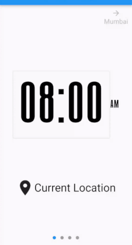
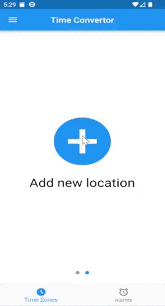

# Time Convertor

An app to make time conversions between timezones as easy as possible

## Features
- This app helps convert between timezones
- Allows you to add timezones based on picking location on maps, choosing zone name, or entering offset from UTC
- It is aranged as swipable pages so you can easily see difference between zones
- Allows you to change the time that being converted and see that change across all the added time zones (does not have to be current time)

 

## To Build
- Clone the repo
- Create a .env file in the root folder
- add these 2 lines to it 
```
MAP_API={Google Maps API Key}
TIMEZONEDB_API={TimeZoneDB API Key}
```
- add this line in the `<application>` tag in the file `android/app/src/main/AndroidManifest.xml`
```xml
<meta-data android:name="com.google.android.geo.API_KEY"
            android:value="{Google Maps API Key}"/>
```
- run `flutter pub run build_runner build` to generate `lib/env/env.g.dart`
- run `flutter build`
